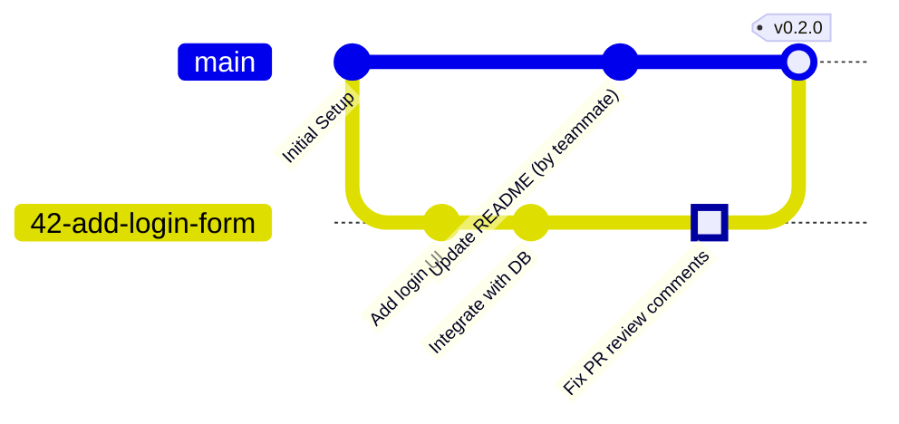

# Development Process and Configuration Management

This document outlines the actual development process, Git workflow, and configuration management practices used by the FaceGuardV3 team.

## 1. Task Management and Issue Tracking

We use **GitHub Projects** and **GitHub Milestones** to manage our workflows:
- **Product Backlog:** Managed in a dedicated GitHub Project (e.g., `FaceGuardV3-Product-Backlog`).
- **Sprint Backlog:** Managed in separate, sprint-specific GitHub Projects (e.g., `FaceGuardV3-Sprint-3-Backlog`).
- **Sprint Container:** We use GitHub Milestones (e.g., `Sprint 3`) to track sprint dates, store the Sprint Goal, and containerize the selected issues.

### Issue Types & Templates
**No product work is started without first creating a tracked Issue.** Issues are created and used as the primary source of truth for all tasks, utilizing predefined templates located in `.github/ISSUE_TEMPLATE/`:
- **User Story:** Defines the user role, desired action, expected value, and acceptance criteria.
- **Bug Report:** Captures problem description, reproduction steps, expected/actual behavior, and environment.
- **Other PBI:** For technical or infrastructure work.
- **Course Task:** For assignments and reporting (does not count toward product scope).

### Board Statuses (Work Status)
The team uses the following board statuses (columns) and explicit **entry criteria** for moving work into each state:
- **To Do:** (Entry criteria: The Product Backlog Item (PBI) is refined and prioritized, but not yet selected for the current Sprint.)
- **Ready:** (Entry criteria: The PBI is selected for the current Sprint, assigned, estimated, has clear acceptance criteria, and can be started without major unanswered questions.)
- **In Progress:** (Entry criteria: A developer is actively assigned and a feature branch has been created to start the work.)
- **Review:** (Entry criteria: The implementation is complete, and the associated Pull Request (PR) has been opened and linked to the issue.)
- **Done:** (Entry criteria: The PR is approved and merged into the protected default branch, all acceptance criteria are met, and the Definition of Done (DoD) is satisfied.)

## 2. Git and Review Workflow

The team follows a trunk-based workflow adapted for GitHub Pull Requests.

### GitGraph Diagram

**What the diagram shows:**
The diagram illustrates our standard workflow in a collaborative environment. While a developer works on a feature branch (e.g., `42-add-login-form`), other teammates might push changes to `main`. Once the initial feature work is pushed and a Pull Request is opened, the review process begins. The developer pushes additional commits (highlighted) to address PR review feedback. Finally, after approval and passing CI, the branch is merged into `main` using a merge commit.

### Workflow Rules
1. **Branch Creation & Naming:** Branches are created from the issue page where possible. The naming convention is `<issue-number>-<short-description>` (e.g., `42-add-login-form`).
2. **Pull Requests:** All changes are submitted via PRs. A PR template (`.github/pull_request_template.md`) prompts the author for a summary, testing performed, and a reviewer checklist.
3. **Review Process:** 
   - Direct pushes to `main` are disabled.
   - PR authors cannot approve their own changes.
   - At least **one approval** from a different team member is required before merging.
4. **Merging:** Changes are merged using **Merge Commits** (Squash and Rebase are disabled).
5. **Issue Resolution:** Issues are linked to the PR and are automatically closed when the PR is merged, provided all acceptance criteria and the DoD are satisfied.

## 3. Configuration and Secrets Management

We prioritize security and portability by keeping sensitive data out of version control.

- **Secret Storage & Runtime Configuration:** All runtime secrets and environment variables are stored securely in `backend/.env`. During runtime, this configuration is supplied to the backend container natively through the `env_file` directive in `docker-compose.yml`.
- **Ignored Files:** Our `.gitignore` strictly ignores sensitive and environment-specific files, including `backend/.env`, `.coverage`, and large binaries/models (unless Git LFS is used).
- **Sanitized Examples:** To onboard new developers, we commit a sanitized example file: `backend/.env.example`. Developers copy this file to `backend/.env` and fill in the actual local credentials.
- **CI Configuration:** CI uses explicit, non-production test-only values and an ephemeral PostgreSQL service for integration tests. Production/customer secrets remain outside workflow files and the repository.
- **Deployment Configuration:** For edge deployment (e.g., on the Raspberry Pi), deployment configuration is handled manually by an administrator who securely sets up the `.env` file on the production device. CI does not deploy secrets directly to the edge.

## 4. Reproducible Development Environment

To eliminate "it works on my machine" issues, especially given our dependencies on native machine learning libraries (OpenCV, InsightFace), we use a containerized setup.

- **Docker & Docker Compose:** The base product is defined in `docker/docker-compose.yml`; Raspberry Pi mappings are an override in `docker/docker-compose.pi.yml`. Use `docker compose --env-file backend/.env -f docker/docker-compose.yml up --build`. Pi deployment uses both `-f` files. The backend initializes/migrates its PostgreSQL schema during startup. Frontend `VITE_*` values are build-time inputs, so URL or camera-mode changes require an image rebuild.
- **Dependency determinism limitation:** Frontend installations are locked by `package-lock.json`; the Python requirement files currently name direct dependencies without version constraints. A clean backend image therefore resolves the package releases available at build time. The audit validates the resolved image, but exact/bit-for-bit backend dependency reproduction requires a reviewed lock or constraints policy and remains a team decision.

## 5. Continuous Integration (CI) Process

Our repository relies on GitHub Actions for Continuous Integration. The CI pipeline runs automatically on all PRs and pushes to the `main` branch.

- **Quality Gates & Testing:** The `ci.yml` workflow enforces code quality and behavior by running:
  - Formatting checks (Black) and source-code linting (Flake8).
  - Separate backend Unit, Integration, and Quality Requirement Test steps, including QRT-005 against a real ephemeral PostgreSQL service.
  - Full-backend XML/JSON line coverage plus `scripts/check_critical_coverage.py`, which enforces 30% for each documented critical module.
  - Frontend Vitest, Oxlint, TypeScript/build, and dependency-audit gates.
  - Base/Pi Compose validation and a strict MkDocs build.
  - **Additional QA Check:** A security vulnerability scan using **Bandit**.
- **Link Checking:** The `lychee.yml` workflow checks all Markdown files across the repository to ensure no broken links are committed.
- **Image publication and edge deployment:** `.github/workflows/docker-publish.yml` automatically builds the FastAPI backend from `docker/Dockerfile.hub` for `linux/amd64` and `linux/arm64` and pushes the Docker Hub `faceguard:latest` tag on pushes to `main` and `v*` tags. It is a separate workflow rather than a downstream `needs` job, so protected-branch/PR gates are the release safeguard; the publication workflow itself does not wait for the concurrent push CI run. It does not publish the frontend/database or deploy customer Raspberry Pis and never supplies customer secrets. Edge deployment remains a manual administrator operation.

## 6. Recorded process discrepancy

During the repository audit completed on 2026-07-17, duplicate-registration and LED-feedback functionality already appeared in release/UAT records while their stated automated QRTs were not available as required evidence. This note does not rewrite historical issue or acceptance records and assigns no individual fault.

- Duplicate registration previously had a Planned QRT pointing to a nonexistent/mock-only design. QRT-005 is now implemented through FastAPI and real isolated PostgreSQL, including rollback/data-integrity and concurrent check/insert behavior, and is a CI gate.
- LED feedback had no automated physical latency evidence. The software ordering/lifecycle precheck now runs in CI, but it cannot measure a real LED; QRT-006 remains Planned until a Raspberry Pi hardware-in-the-loop runner retains physical latency evidence.

Future Done decisions must apply the current DoD status honestly: supporting software checks may accompany a manual hardware result, but they cannot change a physical QRT to Implemented.
