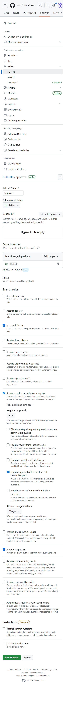
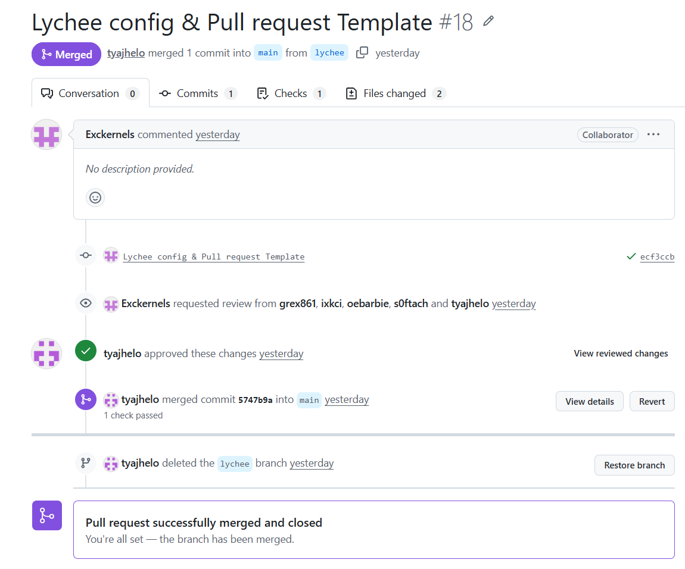
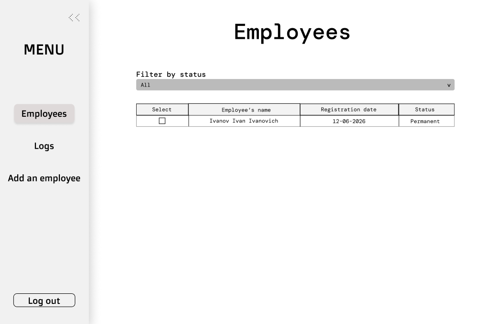
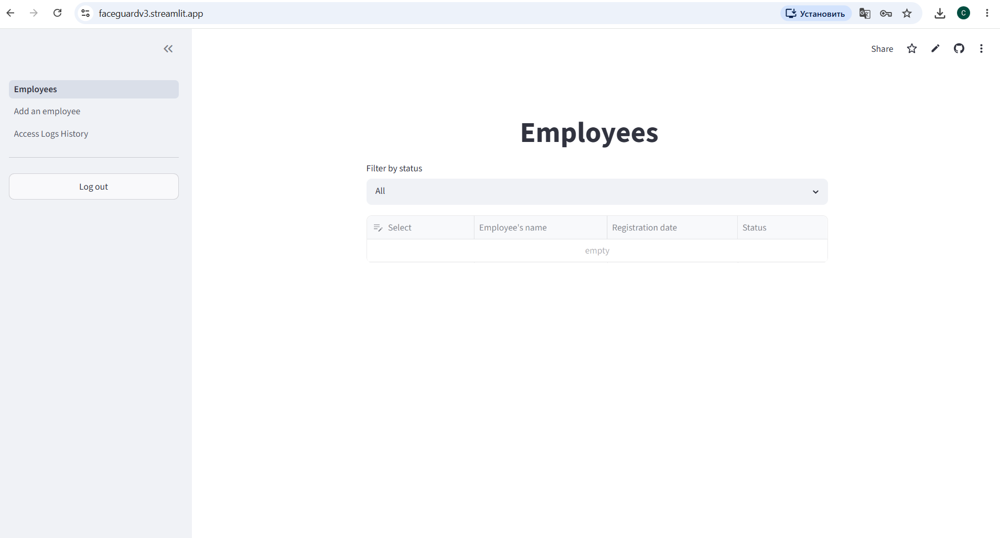

# Assignment Report

## 1. Description 
**Faceguard** is a face recognition access control system for the university laboratory. It replaces physical cards by automatically identifying users via camera. Administrators can manage users through a web interface, while the system handles real-time recognition on a Raspberry Pi.  
[LICENSE](https://github.com/Innopolis-Robotics-Society/FaceGuardV3/blob/bead97ef8bdd7b929570978b5cae5d6319fc353a/LICENSE)

## 2. User Stories  
[User Stories](./user-stories.md)
   
## 3. The Interactive Prototype  
   - [Interactive prototype in Figma (View-Only)](https://www.figma.com/site/EW7rPFjvmRSljqN4YF11s5/Untitled?node-id=0-1&t=IpdOrloTLuXGB5YM-1)  
   #### Project from the outside
   - 
   #### Admin panel
   - 
   - 
   - 
   - 
   - 

## **4. MVP v0**  
   - [MVP v0 Report](mvp-v0-report.md)
   - [Deployed MVP v0](https://faceguardv3.streamlit.app)
   - [Run Instructions](https://github.com/Innopolis-Robotics-Society/FaceGuardV3/blob/main/README.md)
   - [Public Video Demonstration](https://drive.google.com/file/d/1H3z0uBsEWGSThQTx3_miLo73aQnXwOgz/view?usp=sharing)

## **5. Minimal PR/MR template** created during Week 2 

- [Minimal PR/MR template](https://github.com/Innopolis-Robotics-Society/FaceGuardV3/blob/main/.github/pull_request_template.md)
- [Reviewed PR](https://github.com/Innopolis-Robotics-Society/FaceGuardV3/pull/18)

## **6. Lychee configuration** 

- [Lychee configuration workflow](https://github.com/Innopolis-Robotics-Society/FaceGuardV3/blob/main/.github/workflows/lychee.yml)
- [Latest successful protected-default-branch run](https://github.com/Innopolis-Robotics-Society/FaceGuardV3/actions/runs/27469928204)

## **7. Excluded Lychee links**  

No links were excluded from Lychee checks

## **8. Screenshots**  
### Protected default branch settings

### Reviewed PR

### Prototype

### MVP v0

## 9. Coverage section  

### Prototype covers:
- US-01: Add people to database (Add Employee page)
- US-03: Remove people from database (Remove Employee page)
- US-07: Temporary access (Add Employee form with access type selection)
- US-09: Logs of all attempts (Access Logs History page)
- US-14: View list of people with access (Employees page)

The runnable MVP v0 foundation and repeatable smoke-check scenario is documented in [mvp-v0-report.md](mvp-v0-report.md).

### MVP v0 covers:  
- US-01: Add people to database (Employee add form stores data in PostgreSQL)
- US-03: Remove people from database (Employee delete is functional)
- US-07: Temporary access (Access type selection is implemented in the form)
- US-09: Logs of failed attempts (Logs page reads from and writes to PostgreSQL)
- US-14: View list of people with access (Employees page reads from PostgreSQL)

Face recognition (US-02), accuracy requirements (US-05), and database 
capacity (US-04) are not yet implemented in MVP v0 and will be addressed in MVP v1.

## 10. Customer Transcript  
[Link](./customer-meeting-transcript.md)

## 11. Customer Meeting Summary  
[Link](./customer-meeting-summary.md)  

## 12. Week 2 Analysis  
[Link](./analysis.md)  

## 13. LLM report  
[Link](./llm-report.md)  
