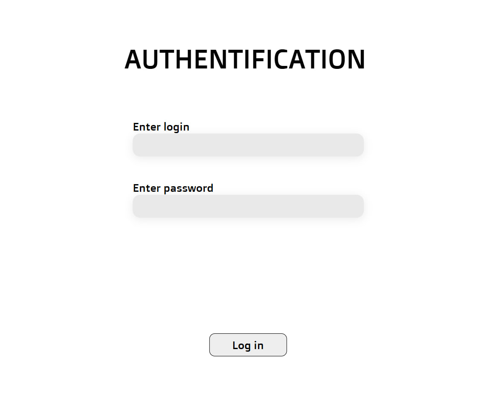
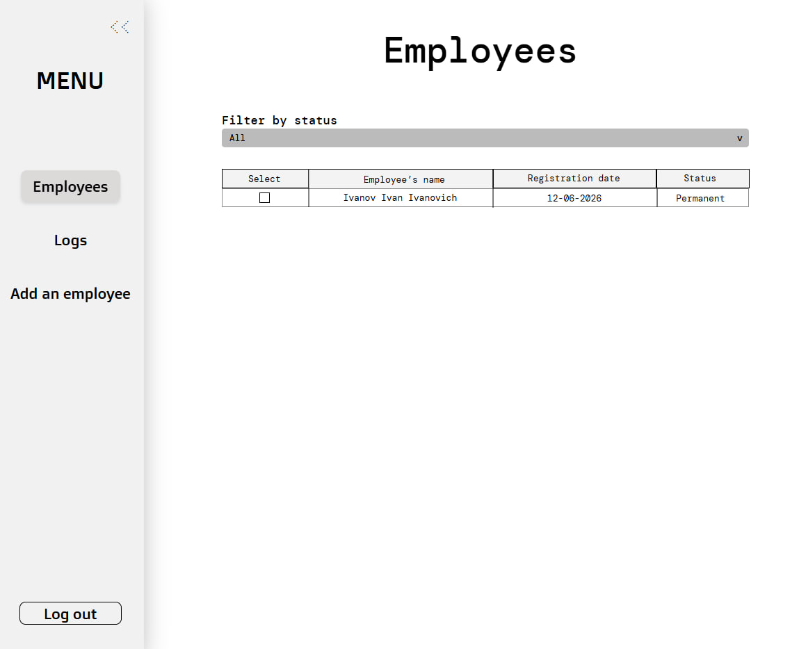
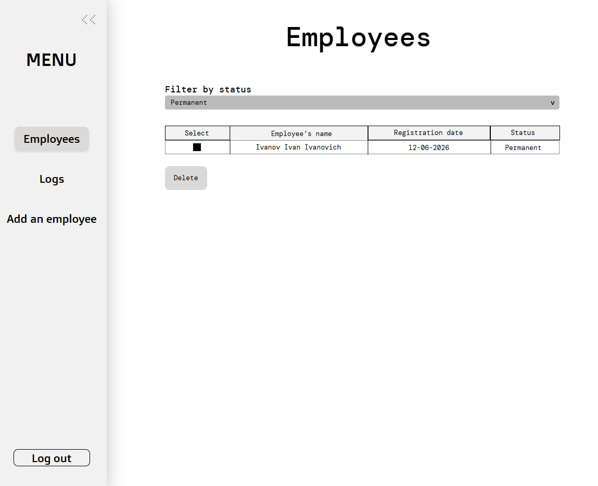
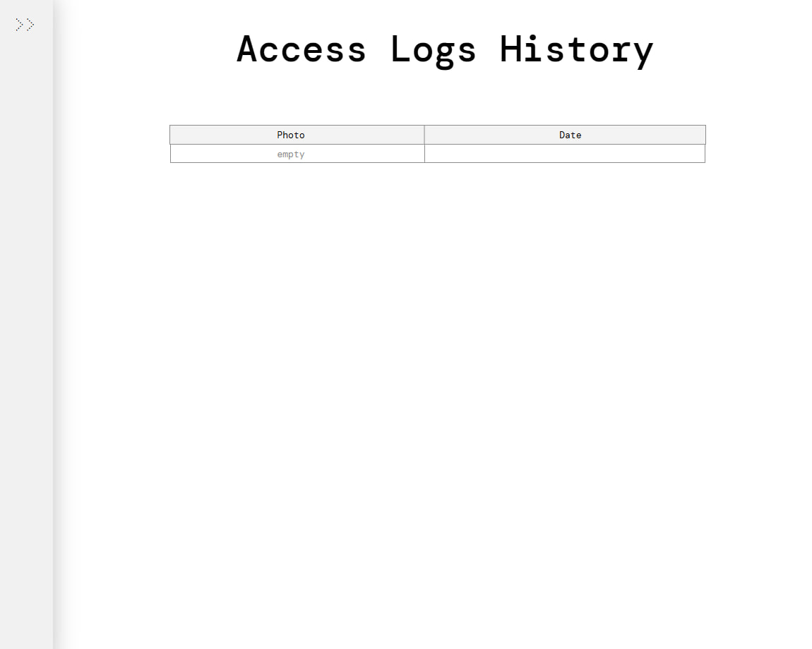

# Assignment Report

## 1. Description 
**Faceguard** is a face recognition access control system for the university laboratory. It replaces physical cards by automatically identifying users via camera. Administrators can manage users through a web interface, while the system handles real-time recognition on a Raspberry Pi.  
[LICENSE](https://github.com/Innopolis-Robotics-Society/FaceGuardV3/blob/bead97ef8bdd7b929570978b5cae5d6319fc353a/LICENSE)

## 2. User Stories  
[User Stories](./user-stories.md)
   
## 3. The Interactive Prototype  
   - [Interactive prototype in Figma (View-Only)](https://www.figma.com/site/EW7rPFjvmRSljqN4YF11s5/Untitled?node-id=0-1&t=IpdOrloTLuXGB5YM-1)  
   #### Project from the outside
   - 
   #### Admin panel
   - 
   - 
   - 
   - 
   - 

## **4. MVP v0**  
   - [MVP v0 Report](mvp-v0-report.md)
   - [Deployed MVP v0](https://faceguardv3.streamlit.app)
   - [Run Instructions](https://github.com/Innopolis-Robotics-Society/FaceGuardV3/blob/main/README.md)
   - [Public Video Demonstration](https://drive.google.com/file/d/1H3z0uBsEWGSThQTx3_miLo73aQnXwOgz/view?usp=sharing)

## **5. Minimal PR/MR template** created during Week 2 

- [Minimal PR/MR template](https://github.com/Innopolis-Robotics-Society/FaceGuardV3/blob/main/.github/pull_request_template.md)
- [Reviewed PR](https://github.com/Innopolis-Robotics-Society/FaceGuardV3/pull/18)

## **6. Lychee configuration** 

- [Lychee configuration workflow](https://github.com/Innopolis-Robotics-Society/FaceGuardV3/blob/main/.github/workflows/lychee.yml)
- [Latest successful protected-default-branch run](https://github.com/Innopolis-Robotics-Society/FaceGuardV3/actions/runs/27469928204)

## **7. Excluded Lychee links**  

No links were excluded from Lychee checks

## **8. Screenshots**  **[TODO - Varya]**
reports/week2/images/
Screenshots embedded from reports/week2/images/ (use PNG format; keep file sizes reasonable):
- Protected default branch settings
- Example reviewed PR/MR (must be a review by another team member, not a self-review)
- Selected prototype and interface artifacts
- Deployed MVP v0 or runnable artifact

## **9. Coverage section**  **[TODO - Varya]**
- References the stable IDs covered by the prototype.
- Explains the selected prototype and interface artifacts and references the stable user-story IDs represented by them.
- Links to reports/week2/mvp-v0-report.md, which explains the MVP v0 foundation and documents the repeatable smoke-check scenario.
- References stable user-story IDs represented by MVP v0 where applicable. For example, if MVP v0 sets up authentication infrastructure, reference the related user story (e.g., US-02: User login) even if login is not yet functional. MVP v0 is a product foundation and does not need to implement a complete user story.

## 10. Customer Transcript  
[Link](./customer-meeting-transcript.md)

## 11. Customer Meeting Summary  
[Link](./customer-meeting-summary.md)  

## 12. Week 2 Analysis  
[Link](./analysis.md)  

## 13. LLM report  
[Link](./llm-report.md)  
