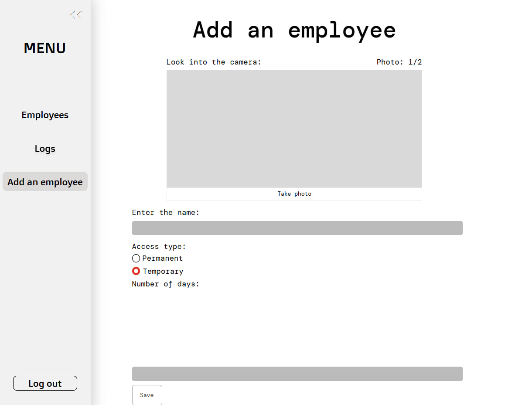

# Week 3 Report — Assignment 3

## 1. Project Description

**Project name:** FaceGuardV3  
**Team number:** 17  
**Repository:** [FaceGuardV3](https://github.com/Innopolis-Robotics-Society/FaceGuardV3)  
**License:** [LICENSE](../../LICENSE)

FaceGuardV3 is a face recognition access control system for a university laboratory. The system is designed to replace physical access cards by identifying users through a camera and allowing administrators to manage employees through a web interface.

---

## 2. User Stories and Product Backlog

### Historical Assignment 2 user stories

- [Week 2 user stories](../week2/user-stories.md)

### Current user-story index

- [Current user-story index](../../docs/user-stories.md)

### Product Backlog and Sprint Backlog

- [Product Backlog board/view](https://github.com/orgs/Innopolis-Robotics-Society/projects/5)
- [Current Sprint Backlog board/view](https://github.com/orgs/Innopolis-Robotics-Society/projects/6)
- [Current Sprint milestone](https://github.com/Innopolis-Robotics-Society/FaceGuardV3/milestone/1)
- [MVP v1 release](https://github.com/Innopolis-Robotics-Society/FaceGuardV3/releases/tag/1.0.0)

**Total Product Backlog size:** 66 Story Points  
**Total current Sprint size:** 14 Story Points

Course Task issues and removed items are not counted as qualifying Product Backlog Items.

---

## 3. MVP v1 Scope

The selected MVP v1 scope includes:

- Docker-based local deployment.
- OpenCV and InsightFace integration.
- Face embedding generation and matching.
- Employee registration and employee database functionality.
- Face recognition testing page.
- Access logs and recognition attempt storage.

The MVP v1 release is available here:

- [Release 1.0.0 — MVP v1](https://github.com/Innopolis-Robotics-Society/FaceGuardV3/releases/tag/1.0.0)

---

## 4. Customer Feedback Addressed in MVP v1

MVP v1 addressed the following customer feedback points:

- Employee data can be stored and managed through the application.
- Employee registration was implemented.
- Recognition testing was made available through a webcam-based test interface.
- Access and recognition attempts are stored in logs.
- Dockerization was added as a high-priority technical requirement.
- Recognition logic was connected to stored employee data for MVP v1 testing.

Remaining requested changes and follow-up items:

- Add explicit temporary access start and end time fields.
- Capture 5–10 frames and use averaged embeddings for better recognition reliability.
- Apply OpenCV face cropping before embedding extraction.
- Test a lighter recognition model suitable for Raspberry Pi 5.
- Separate model confidence score from overall system success rate.
- Continue Raspberry Pi 5 setup and real webcam testing.

---

## 5. Backlog and Workflow Explanation

The team used the following issue types:

- **User Story** — user-facing product requirement.
- **Other PBI** — technical, backend, frontend, database, testing, deployment, documentation, or infrastructure task.
- **Bug Report** — defect or incorrect behavior.
- **Course Task** — assignment-related reporting, evidence, workflow, or documentation task.

The team tracked work using:

- MoSCoW priority;
- Story Points;
- Work Status;
- Sprint milestone;
- MVP version;
- Assignee;
- Reviewer.

The Sprint milestone is used as the Sprint Backlog container. MVP version is tracked separately.

---

## 6. MVP v1 Verification Evidence

| Item | Issue | Pull Request | Evidence |
|---|---|---|---|
| Docker containerization | #56 | [PR #66 — issue 56 add docker](https://github.com/Innopolis-Robotics-Society/FaceGuardV3/pull/66) | Dockerfile, docker-compose setup, and README Docker run instructions were added. |
| OpenCV and InsightFace integration | #62, #54 | [PR #74 — add OpenCV & InsightFace](https://github.com/Innopolis-Robotics-Society/FaceGuardV3/pull/74) | Camera-based face enrollment, embedding generation, and recognition pipeline were implemented. |
| Repository workflow | #69 | [PR #70 — Extend PR template with changelog checklist](https://github.com/Innopolis-Robotics-Society/FaceGuardV3/pull/70) | Extended PR template and changelog decision workflow were added. |
| Customer review documentation | Customer review task | [PR #77 — Customer review summary and transcript](https://github.com/Innopolis-Robotics-Society/FaceGuardV3/pull/77) | Customer review summary and transcript were added to Week 3 reports. |
| LLM usage report | LLM usage task | [PR #82 — Add LLM usage report](https://github.com/Innopolis-Robotics-Society/FaceGuardV3/pull/82) | LLM usage report was added to Week 3 reports. |

---

## 7. Repository Workflow Evidence

### Required issue templates

- [User Story issue template](../../.github/ISSUE_TEMPLATE/user-story.yml)
- [Other PBI issue template](../../.github/ISSUE_TEMPLATE/other-pbi.yml)
- [Course Task issue template](../../.github/ISSUE_TEMPLATE/course-task.yml)
- [Bug Report issue template](../../.github/ISSUE_TEMPLATE/bug-report.yml)

### Extended PR/MR template

- [Pull request template](../../.github/pull_request_template.md)

The pull request template includes:

- linked issue section;
- issue-number branch naming checklist;
- acceptance criteria verification;
- testing evidence;
- documentation impact;
- changelog checklist;
- Definition of Done checklist;
- reviewer notes.

### Reviewed issue-linked PRs/MRs

| PR/MR | Linked issue | Branch | Reviewer | Status |
|---|---|---|---|---|
| [PR #66 — Add Docker](https://github.com/Innopolis-Robotics-Society/FaceGuardV3/pull/66) | #56 | `issue-56-add-docker` | @s0ftach | Approved / Merged |
| [PR #70 — Extend PR template with changelog checklist](https://github.com/Innopolis-Robotics-Society/FaceGuardV3/pull/70) | #69 | `69-extend-pr-template-changelog` | Reviewer in PR | Approved / Merged |
| [PR #74 — Add OpenCV & InsightFace](https://github.com/Innopolis-Robotics-Society/FaceGuardV3/pull/74) | #62, #54 | `62-add-opencv-insightface` | @ixkci | Approved / Merged |
| [PR #77 — Customer review summary and transcript](https://github.com/Innopolis-Robotics-Society/FaceGuardV3/pull/77) | Customer review task | `customer-review` | @tyajhelo | Approved / Merged |
| [PR #82 — Add LLM usage report](https://github.com/Innopolis-Robotics-Society/FaceGuardV3/pull/82) | LLM usage task | Branch in PR | Reviewer in PR | Approved / Merged |

Workflow evidence includes:

- issue-linked branches using `<issue-number>-short-description`;
- PRs/MRs linked to issues with `Closes #...`;
- acceptance criteria verification before merge;
- meaningful review comments;
- approvals from different team members;
- merge-commit workflow;
- changelog decision workflow.

---

## 8. Release and Changelog

MVP v1 release:

- [Release 1.0.0 — MVP v1](https://github.com/Innopolis-Robotics-Society/FaceGuardV3/releases/tag/1.0.0)

Root changelog:

- [CHANGELOG.md](https://github.com/Innopolis-Robotics-Society/FaceGuardV3/blob/main/CHANGELOG.md)

---

## 9. Delivered MVP v1 Access

Run instructions are available in the root README:

- [README.md](https://github.com/Innopolis-Robotics-Society/FaceGuardV3/blob/main/README.md)

The MVP v1 application can be started with Docker and opened at:

```text
http://localhost:8501
```

Public sanitized video demonstration shorter than two minutes:

- [MVP v1 demo video](https://drive.google.com/file/d/1ctrFGgU4IpdR5F3YLo2dEx7cxT0Bl8No/view?usp=drive_link)

---

## 10. Roadmap

Roadmap:

- [docs/roadmap.md](../../docs/roadmap.md)

Short roadmap direction:

- Improve recognition reliability.
- Implement 5–10 frame averaging.
- Add OpenCV face cropping before embedding extraction.
- Add explicit temporary access start and end time fields.
- Test a lighter recognition model suitable for Raspberry Pi 5.
- Continue Raspberry Pi 5 and real webcam setup.

---

## 11. Definition of Done

Definition of Done:

- [docs/definition-of-done.md](../../docs/definition-of-done.md)

A PBI is marked `Done` only when its acceptance criteria are satisfied, verification is completed, the PR/MR is reviewed and approved by another team member, and the issue-linked PR/MR is merged.

---

## 12. Process Requirements

Process requirements:

- [Process_Requirements.md](../../Process_Requirements.md)

---

## 13. Contribution Traceability

| Team member | GitHub username | Main contribution area |
|---|---|---|
| Sofia | @s0ftach | Acceptance criteria, Definition of Done, Sprint planning, roadmap, MVP v1 work |
| Varvara | @oebarbie | Product Backlog, acceptance criteria, Sprint Backlog, MVP v1 work, backend/database work |
| Maksim | @ixkci | Sprint review with customer, customer review documentation, LLM usage |
| Sasha | @grex861 | Week reflection and retrospective-related reporting |
| Pavel | @tyajhelo | User stories, reviews, Week 3 documentation support |
| Maksim | @Exckernels | Repository workflow, PR template workflow, Week 3 repository report, MVP v1 OpenCV/InsightFace work |

---

## 14. Screenshots

Screenshots are stored in:

```text
reports/week3/images/
```

### Delivered MVP v1 — Add Employee page



---

## 15. Customer Review

Customer review summary:

- [customer-review-summary.md](customer-review-summary.md)

Customer review transcript / notes:

- [customer-review-transcript.md](customer-review-transcript.md)
- [customer-review-notes.md](customer-review-notes.md)

Customer review result:

**Approved with requested changes.**

Main customer feedback:

- Dockerization should be prioritized as early as possible.
- The system should distinguish model confidence from overall success rate.
- Temporary access should use explicit start and end time fields.
- Recognition should use 5–10 captured frames and averaged embeddings.
- OpenCV face cropping should be applied before embedding extraction.
- A lighter model should be tested for Raspberry Pi 5.

Resulting Product Backlog updates:

- Raspberry Pi 5 environment setup and real webcam connection moved to the next MVP iteration.
- Temporary access design must be updated from number of days to a date range.
- Accuracy testing must be planned with real device metrics.
- Accessories recognition and liveness detection estimates must be revisited after first metrics.

---

## 16. Reflection

Week 3 reflection:

- [reflection.md](reflection.md)

Main reflection points:

- Migrating the Product Backlog into GitHub revealed hidden dependencies.
- Accuracy-related tasks were more complex than initial MVP v0 UI work.
- The customer clarified that success rate and confidence score are different.
- Docker confirmed that cross-environment portability would be a bottleneck without containers.

---

## 17. Retrospective

Week 3 retrospective:

- [retrospective.md](retrospective.md)

The retrospective summarizes what went well, what did not go well, and concrete action points for the next Sprint.

---

## 18. LLM Usage

LLM usage report:

- [llm-report.md](llm-report.md)

LLM tools were used as reference support for understanding Assignment 3 requirements, Git/GitHub workflow, pull request descriptions, review comments, and OpenCV-related implementation questions. Final repository changes, implementation decisions, pull requests, reviews, approvals, and submitted artifacts were completed and checked by the team.

---

## 19. Current Product Status

Current product status:

- MVP v1 release is available as release `1.0.0`.
- Docker run instructions are available in the root README.
- OpenCV and InsightFace recognition work was merged.
- Customer review artifacts were added to Week 3 reports.
- Changelog and release mapping are available.
- The next iteration should focus on reliability, Raspberry Pi 5 testing, and temporary access improvements.

---

## 20. Next Steps

Next steps:

1. Complete Raspberry Pi 5 setup and real webcam connection.
2. Implement 5–10 frame capture and averaged embedding comparison.
3. Add OpenCV face cropping before embedding extraction.
4. Update temporary access design with explicit start and end time fields.
5. Test a lighter model suitable for Raspberry Pi 5.
6. Keep evidence collection synchronized with issues, PRs, reviews, approvals, and changelog decisions.
